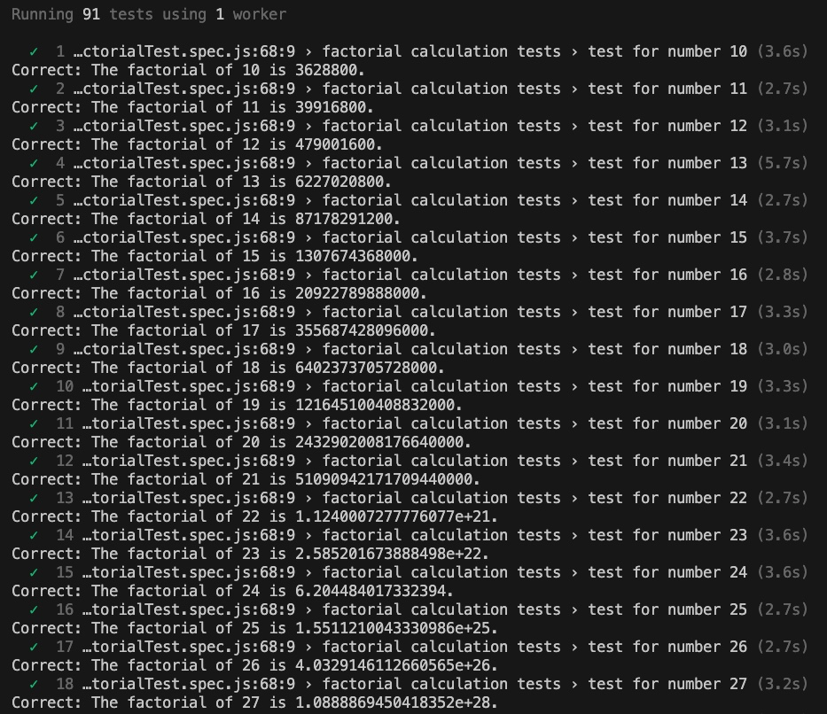

## Factorial Calculator Test Suite

### Goal
The goal of this program is to test a web-based factorial calculator, ensuring its accuracy for calculating the factorial of integers in the range of 10 to 100.  
The program uses Playwright to automate browser interactions with the calculator, inputs numbers, submits the calculation, and verifies that the calculated factorial matches the expected results.

### Logic
For numbers less than 22, the factorial is calculated traditionally. For numbers 22 and above, BigInt is used for accuracy, and the result is formatted in scientific notation with 16 decimal places by default.  
The expected factorial result is adjusted based on the decimal places of the actual result obtained from the webpage.   
The program handles cases where the result is presented with 14, 15, or 16 decimal places, applying specific rounding rules to match the webpage's output format.

### Setup and Running Tests
### Prerequisites
* Node.js installed on your machine
* Git installed on your machine

### Steps
First, clone the repository from its remote git branch:

`git clone https://github.com/dmpapageo/Swissborg-Exercise-1.git` 

Navigate to the Project Directory:

`cd Swissborg-Exercise-1`

Install the necessary Node.js dependencies, including Playwright:

`npm install`

Execute the test suite with the following command:

`npx playwright test`

This will launch the Playwright test runner, which automates the browser interactions with the factorial calculator webpage, inputs numbers from 10 to 100, and verifies the accuracy of the results against the calculated expected values.

### Screenshot

### Observation
Currently the only 2 test cases failing are for calculating the factorial of 60 and 96.
1. While the factorial of 96 in scientific notation with 16 decimal places is 9.9167793487094965×10e+149, the calculator rounds down the last digit instead of up:
- Expected substring: "The factorial of 96 is: 9.916779348709497e+149"
- Received string:    "The factorial of 96 is: 9.916779348709496e+149"
2. As for factorial of 60 in scientific notation with 16 decimal places is 
8.3209871127413899×10e+81.
However the current rounding logic would need to be further developed to round up the 13th decimal digit, assuming the 14th is 9 that is incremented due to rounding up values. Below is how the current logic calculates the factorial of 60:
* Expected substring: "The factorial of 60 is: 8.3209871127413810"
* Received string:    "The factorial of 60 is: 8.32098711274139e+81"

Due to the nature of the issue, it would require to proceed very deep in the process of rounding up earlier decimals, and since only one test is failing for a know reason, the complexity of the test suite is considered adequate to test the behavior of the factorial calculator.